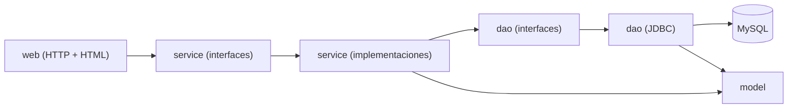
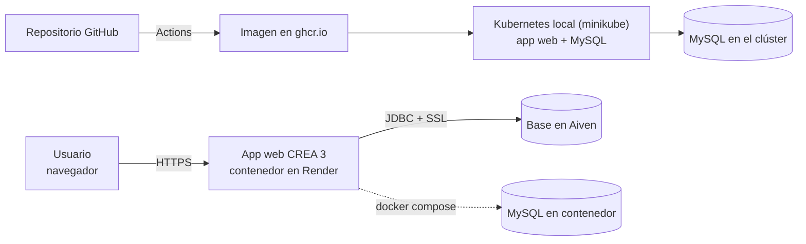

# Arquitectura

## Capas de la aplicación

```mermaid
flowchart LR
  WEB["web (HTTP + HTML)"] --> SI["service (interfaces)"]
  SI --> SS["service (implementaciones)"]
  SS --> DI["dao (interfaces)"]
  DI --> DS["dao (JDBC)"]
  DS --> DB[(MySQL)]
  SS --> M["model"]
  DS --> M
```

## Despliegue

```mermaid
flowchart LR
  U[Usuario<br/>navegador] -->|HTTPS| APP["App web CREA 3<br/>contenedor en Render"]
  GH[Repositorio GitHub] -->|Actions| GHCR[Imagen en ghcr.io]
  GHCR --> K8S["Kubernetes local (minikube)<br/>app web + MySQL"]
  APP -->|JDBC + SSL| AIVEN[(Base en Aiven)]
  APP -.->|docker compose| DBL[(MySQL en contenedor)]
  K8S --> DBK[(MySQL en el clúster)]
```
